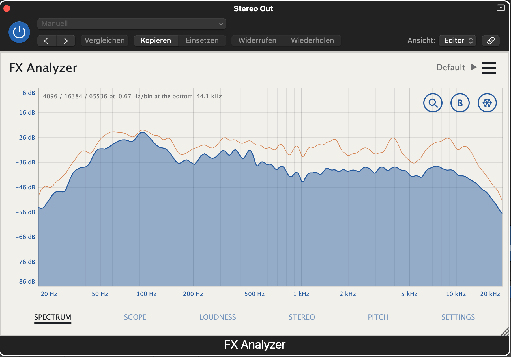

# FX Analyzer

A measurement plugin for macOS: spectrum, oscilloscope, loudness, stereo field
and pitch, on one panel behind one set of controls. Audio Unit, VST3 and
Standalone.



No network code, no telemetry, no account. `JUCE_USE_CURL=0` and
`JUCE_WEB_BROWSER=0` are set at the build level, not just left unused.

It never touches the audio. The buffer that arrives is the buffer that leaves,
sample for sample, and Input Gain scales only what the analysis sees.

That is asserted rather than claimed, at three depths, because each one stops
short of the next:

| | tests |
| --- | --- |
| `AnalyzerCheck` | that `AnalysisHub` does not touch the buffer |
| `EditorShot` | the same through the real `processBlock` |
| `HostNullTest` | the **installed component**, loaded and rendered the way a host does |

The last one is the one that counts. Between `processBlock` and the host lie
JUCE's AU wrapper, the layout negotiation and the render callback — a plugin can
be transparent in every line of its own code and still not be transparent as a
component. `HostNullTest` renders through `aufx/Fxan/Tzor` with
`AudioUnitRender` and compares output to input **bit pattern for bit pattern**,
not within a tolerance: a transparent plugin has no rounding to do, and a
tolerance would hide the quiet gain error the test exists to catch. It does so
while sweeping every parameter to both extremes, so the claim is not that the
plugin is transparent at its defaults but that nothing on the panel can make it
otherwise. `Scripts/install.sh` runs it against what it just installed.

- **AU (v2)** and **VST3** are the deliverables; the Standalone is for
  development.
- Apple Silicon, macOS 26.5, JUCE 9 from `~/JUCE`.
- Listed under the vendor **T'Zorr**, bundle id `TZorr.FXAnalyzer`.
- Codes `aufx / Fxan / Tzor`. The four-character manufacturer code is not
  displayed anywhere — it is the identity. The AU is addressed by it and the
  VST3 class id is a hash of it and the plugin code, so every rename (`NePy` →
  `Clde` → `Tzor`, the last for the first public release) makes a different
  plugin, and an instance saved by an earlier build comes back missing. That was
  accepted each time on the ground that nothing had shipped. The vendor string a
  host shows is separate and comes from `COMPANY_NAME`.

## Building

```
Scripts/build.sh                # build, verify, render
Scripts/install.sh              # install, flush the caches, run auval
```

`build.sh` builds, runs 151 measurement assertions, checks that a saved session
comes back **and that an open panel shows it**, survives a host re-preparing
under load, then renders twelve shots
to `build/shots/*.png` — the six pages plus the spectrum on its linear scale,
unsmoothed and at a narrow range, and the colour editor: surfaces and states no
default page shot shows, two of which have had a bug only a picture would have
caught. It fails loudly at any of those three.

## Why there is no AUv3

There was one, briefly, and it deadlocked Logic every time the plugin was
dragged to another slot during playback. Captured from a real beachball with
`sample`, the ring is:

```
Logic       -[AUAudioUnit_XPC supportedViewConfigurations:]   waits on the plugin
appex XPC   JUCE MessageManager::callSync (AUv3 wrapper)      waits on its main thread
appex main  viewDidDisappear -> nextValidKeyView
              -> HIRunLoopSemaphore wait                      waits on Logic
```

An AUv3's view lives in a separate view service, so tearing it down makes AppKit
ask the host a synchronous question — while JUCE synchronously waits on the
message thread to answer the host's. None of the three points is reachable from
plugin code: the `callSync` is unconditional in JUCE 9.0.1, and the AppKit walk
belongs to the view service. An AU v2 has no view service and no such path.

The samples are kept as `logic-hang.txt` and `appex-hang.txt`. Anyone tempted to
add the AUv3 back should read them, and should know that it cannot share
`aufx / Fxan / <manufacturer>` with the AU: built together, the AUv3 wins registration and
the component silently never appears at all.

## The standalone

The standalone takes live audio and **does not pass it to the output**. That is
the one place the plugin writes to its buffer, and it is what makes it safe to
lift JUCE's default input mute: an analyzer at the end of the chain has nothing
downstream but the speakers, and playing your input back at them is the feedback
path the mute exists to prevent. Every other wrapper is bit-transparent, asserted
in `AnalyzerCheck` and again in `EditorShot`.

Three things must all be in place or no signal arrives, and only one of them is
in this repository:

1. The **entitlement** `com.apple.security.device.audio-input`, set via
   `HARDENED_RUNTIME_OPTIONS`. Note that
   `MICROPHONE_PERMISSION_ENABLED` alone does **not** do this — it only writes
   the `NSMicrophoneUsageDescription` string, so the build looks configured and
   the app still cannot record.
2. **macOS permission**, granted once through the dialog the first time the app
   opens an input. It appears under System Settings › Privacy & Security ›
   Microphone.
3. An **input device carrying signal**, chosen in Options › Audio Settings.
   Usually a loopback device (BlackHole, Loopback) carrying the DAW or system
   output — a microphone works but measures the room, not the mix.

The mute is lifted once, on first launch, and recorded in the state. Re-mute it
in Options › Audio Settings and it stays muted.

## The pages

| Page | What it shows |
| --- | --- |
| **Spectrum** | The graph alone, full width: FFT curve, 31 or 63 bars (third- or sixth-octave), or sonogram, peak hold, and three buttons over it — cursor readout (names the note under the pointer), bass zoom, freeze. Every setting for it is on the Settings page. |
| **Scope** | Two traces overlaid, triggered on a rising or falling edge. 1 to 200 ms, auto gain that states its own multiplier. |
| **Loudness** | Momentary, short-term and integrated LUFS to BS.1770-4, loudness range to EBU Tech 3342, true peak, and the distance to a chosen target. The integrated value is dimmed until it rests on five seconds of gated material. |
| **Stereo** | Goniometer rotated so mono is vertical, correlation, balance as a side rather than a signed number, width as side-over-mid energy in dB. |
| **Pitch** | YIN in the time domain — not the FFT peak, which reports the octave on any string instrument. Note, cents, frequency, and the confidence behind them. Concert pitch adjustable from 415 to 466 Hz. |
| **Settings** | Every setting, sixteen of them in six groups — Resolution, Range, Display, Smoothing, Tilt, Input — under a live preview of the spectrum. See below. |

### The Settings page

Rebuilt on 2026-09-24 so that a musical setting can be found by ear: step a
value, watch the curve answer. Two rows of compact steppers, grouped by the
question each one answers, under a **live preview** that is the Spectrum page
itself, embedded — not a simplified copy — so what the preview shows is what the
Spectrum tab shows afterwards, tier seams included.

| Group | Controls |
| --- | --- |
| **Resolution** | Mode (Multi / Single) · FFT Size · Bands (Off … 1/1 oct) |
| **Range** | Top · Range |
| **Display** | View (2D / Bars 31 / Bars 63 / Sonogram) · Scale (Log / Lin) · Theme |
| **Smoothing** | Reactivity · Attack · Release |
| **Tilt** | Slope (0–6 dB/oct, 0.5 steps, alt-click resets) · Pivot (100 Hz … 5 kHz) |
| **Input** | Channel · DC Block · Input Gain |

Two rows of eight, grouped 3-2-3 in both rows so the group edges line up.

- **Bands** is the octave smoothing under a new name: the width of the band each
  point on the curve averages over, 1/24 oct being 24 bands to the octave.
  "Smoothing" now names the group that sets how the curve moves in *time*. The
  stored property is unchanged, so no session notices the rename.
- **Release** is new: the spectrum's fall time, independent of Reactivity. *Auto*
  keeps Reactivity's number. Only the spectrum follows it — the stereo window,
  pitch averaging and peak hold still come from Reactivity. At Very Slow an
  *Auto* attack follows the release actually in use, so the averaging setting
  stays an average when Release is changed; `AnalyzerCheck` measures both the
  fall (one time constant within 1.5 dB at 1, 2 and 4 s) and that coupling.
- **Pivot** is new: the frequency the tilt turns about, which is the one place
  where the drawn level is the measured level. It moves the curve up or down and
  does not bend it — asserted — but it decides which part of the spectrum keeps
  its real height inside Top and Range.
- **Slope** is a value now rather than one of four. It is stored as
  `spectrumTiltDb`; a session saved before that holds only the old
  `spectrumSlope` index and opens on the slope it was saved with.
  `EditorShot --state` checks both.
- The preview hides itself when the window is too small for a readable graph;
  the controls are the part of the page that has to survive a small window.

The Spectrum page had its own column of five steppers (Mode, Scale, Slope, Top,
Range) until the same day. They were removed and are all here now, so every
setting has exactly one place and that place shows its effect; the graph got the
92 points of width back.

### Reactivity

Four settings, ordered slowest first, driving every time constant on the panel
at once — spectrum smoothing, peak-hold fall, the correlation window, pitch
averaging.

**Very Slow** is not just a longer version of Slow. The three faster settings
rise instantly and only smooth the fall, which is what draws a transient at its
real height. Very Slow smooths both directions equally, which turns the curve
from a peak envelope into a **running average of the programme** — the thing a
master is actually judged on. Under a two-second release with an instant rise,
the same alternating signal settles 10 dB higher, on its loudest moments rather
than its balance; `AnalyzerCheck` measures exactly that difference.

At Very Slow the peak-hold line holds for six seconds, because the live curve is
no longer reporting what the loudest moment did.

**Attack** in Settings overrides the rise time independently of Reactivity.
*Auto* is the default and keeps the coupling above. The rest is a trade, and the
numbers are asserted in `AnalyzerCheck` so this table cannot drift away from the
code — measured on a signal alternating between −6 and −26 dBFS, true mean −16:

| Attack | reaches within 1 dB | reads |
| --- | --- | --- |
| 2 s | 9.8 s | −16.4 dB — the honest average |
| 1 s | 4.9 s | −12.8 dB |
| 0.5 s | 2.5 s | −10.1 dB |
| 0.25 s | 1.2 s | −8.4 dB |
| Instant | 0.03 s | −6.3 dB — a peak envelope |

Faster is not better. The left column is how long you wait to see a change; the
right one is how far the reading drifts towards the loud moments while you do.
Which matters depends on whether you are working or comparing.

**Release** is the other half: Auto, then 4 s down to 50 ms. It replaces the
spectrum column of the table below and nothing else.

Each measurement has its own constant, because they answer different questions:

| Reactivity | Spectrum | Stereo | Pitch |
| --- | --- | --- | --- |
| Very Slow | 2.00 s | 2.00 s | 1.00 s |
| Slow | 0.50 s | 1.00 s | 0.50 s |
| Medium | 0.15 s | 0.50 s | 0.25 s |
| Fast | 0.035 s | 0.10 s | 0.05 s |

**Loudness is deliberately absent from that table.** BS.1770 fixes 400 ms
momentary, 3 s short-term and the gating block. Those are the measurement, not a
display preference, and a LUFS meter with an adjustable window is not a LUFS
meter.

### Resolution

**Multi** (the default) runs three window lengths at once and splices them by
frequency, each band getting the shortest window that resolves it. The tiers
follow from "a bin no wider than a semitone", not from taste:

| FFT | resolution | window | useful down to |
| --- | --- | --- | --- |
| 4096 | 11.72 Hz | 85 ms | ~200 Hz |
| 16384 | 2.93 Hz | 341 ms | ~50 Hz |
| 65536 | 0.73 Hz | 1365 ms | ~13 Hz |

The middle tier does not save CPU — it saves sluggishness, giving 50–200 Hz a
341 ms window instead of a 1365 ms one. Crossovers are computed from the sample
rate, so at 96 kHz they double by themselves. Cost measured: **2.1 % of one core
against 0.9 % for Single**.

`vDSP` is not what makes this possible — it already backs `juce::dsp::FFT`.
Resolution comes from window length alone; vDSP only makes long windows cheap.

**The seam.** A 65536-point bin is sixteen times narrower than a 4096-point one
and holds 12 dB less of any broadband signal, so the noise floor would step at
every crossover. With smoothing on, one constant per tier fixes it exactly: for
a band of fixed *relative* width the bin count is proportional to N and the
displayed value is the mean, so the tiers differ by exactly `10·log10(N₂/N₁)` —
for tones and for noise alike. `AnalyzerCheck` holds white noise to under 2 dB
across both seams.

That is why **Multi needs smoothing switched on**. With no bands there is no
fixed relative width and no constant can reconcile tones and noise at once; with
Smoothing on `Off`, the display falls back to one tier.

**A caveat worth knowing.** A third-octave band is 23 % wide — four semitones —
so it merges neighbouring bass notes no matter how fine the transform beneath it
is. That is why the default is **1/24 oct** (2.9 %, half a semitone). Asserted: E1 and F1 show a 15.6 dB dip between them at
1/24 oct in Multi, and none at all at one resolution.

### Resolution and smoothing

`Multi` needs bands to splice across; with `Bands = Off` (the octave smoothing) there are none, and
no constant reconciles tones and noise at the seam. So `Off` forces a single
tier — correctly, but for a while it did so **silently**: the Settings page went
on showing `Multi` while the display worked with one tier, and nothing connected
the two. Reported from use as "Resolution sometimes doesn't switch"; it always
switched, it just could not always take effect.

The rule now lives in one place (`FXParams::multiResolutionAvailable`) and the
Spectrum page's info line says so in the warning colour when it bites:
`4096 pt · 11.72 Hz/bin · Multi needs Bands (not Off)` — Settings calls the smoothing *Bands*. `EditorShot --resolution`
checks every combination of the two settings against the tier count.

### Overlap

Windows advance by a quarter of a window — **75 % overlap** — or by one display
frame, whichever is shorter. Two invariants, both asserted by counting frames:
never less than 75 % overlap, and **never slower than the panel repaints**.

The second one only started to bind once the tiers got long. A 65536-point
window at a quarter hop advances every 341 ms, so the bass third of the curve
stood still for a third of a second and then jumped while the 4096-point tier
above it updated 47 times a second — visible as the bass stuttering, worst at
Very Slow where everything else is calm enough for the stepping to show. Capping
the hop in *time* gives every tier at least 30 frames a second whatever its
length, so the whole curve moves at one rate.

Nothing is interpolated: each frame is a real transform of real audio, the
windows simply overlap more — 90 % at 16384 points, 97.6 % at 65536. Measured,
one 65536-point transform costs 0.262 ms, so thirty a second is 0.79 % of a core
and all three tiers together about 1 %. Estimating instead of measuring would
have put that an order of magnitude higher and rejected the honest fix in favour
of smoothing the motion over.

One transform per repaint, which is what this did first, is wrong in both
directions. At 16384 points the window is 341 ms and the display asks every
33 ms, so the same samples were transformed ten times over. At 1024 the window
is 21 ms and **12 ms out of every 33 were never analysed at all** — a transient
could land squarely in a gap.

It also fixes the time constants. `deltaSeconds` is now the hop's own duration
rather than however long the last repaint took, so the smoother behaves the same
on a busy machine as on an idle one. The cost is 0.6 % of one core at 1024 and
4096 points and 1.0 % at 16384 — and roughly flat across sizes now, where before
it grew with the window.

### Smoothing

Time smoothing settles one bin down across frames. It can do nothing about the
comb of peaks and nulls *between* neighbouring bins, because that comb is in
every frame equally — only averaging across frequency removes it. So the
spectrum has both, and Settings offers **Off · 1/24 · 1/12 · 1/6 · 1/3 · 1/1
octave**, defaulting to **1/24**.

A third of an octave is the width reference curves are quoted in and was the
default for that reason — but it is 23 % wide, four semitones, so it merges
neighbouring bass notes however fine the transform beneath it is, which throws
away exactly what the 65536-point tier exists to provide. 1/24 octave is 2.9 %,
half a semitone. The curve is busier; that is the trade, and it is the right way
round for an analyzer whose job is to show what is there.

Two things it gets right that are easy to get wrong:

- **Averaging is done on power, not on decibels.** Averaging decibels averages
  logarithms, which under-weights the loud bin in a band and drags a resonance
  down toward its quiet neighbours — the opposite of what somebody hunting that
  resonance needs. Power averaging is the band's RMS.
- **Three cascaded box passes, not one rectangular band.** A sliding average
  that divides by its bin count peaks where its window is *narrowest*, and a
  constant-fraction-of-an-octave window is always narrower below a bin than
  above it. One rectangular pass moved a tone at bin 512 to bin 457 — a
  semitone. The cascade holds it to within a tenth of the band, which
  `AnalyzerCheck` enforces at every width.

### The scope's time base

1 ms to **2 s**. The long end is for envelopes and settling over whole bars;
past two samples per pixel column `ScopePage` draws a min/max bar per column
rather than a path point per sample, so the cost is bounded by the width of the
window, not by the length of the time base. Measured at 96 kHz: 1.11 % of one
core at 2 s, against 0.14 % at 20 ms.

Two buffers are sized from `FXParams::longestScopeSeconds()` rather than from a
second copy of the number, because there used to be one: the list ended at
200 ms and `AnalysisHub` prepared the oscilloscope with a separate `rate * 0.2`.
`Oscilloscope::capture` clamps to its buffer **silently**, so adding an entry to
the list gave a display labelled "2 s" showing 200 ms. `AnalyzerCheck` now
asserts requested-equals-delivered for every entry at 44.1, 48, 96 and 192 kHz —
forty assertions whose only job is to catch that clamp.

The ring gained a third term for the same reason. The trigger searches *twice*
the window, so 2 s needs 4 s of history; the FFT term is a fixed number of
samples and shrinks in time as the rate rises, so at 96 kHz and above the ring
was too small and the trigger would have searched audio already overwritten.

### Defaults

The plugin ships set to the configuration arrived at in use, kept as
`default.fxapreset`:

| | |
| --- | --- |
| Theme | **Paper** |
| Reactivity | Very Slow |
| Spectrum | 4096 / 16384 / 65536, 1/3 oct, Multi, bass zoom off |
| dB axis | −6 dB over 80 dB |
| Slope | 4.5 dB/oct about 1 kHz |
| Attack / Release | Auto / Auto |
| Scope | 2 s, free running |

Two of those reverse an earlier decision on purpose. **Smoothing is 1/3 oct
again**, not 1/24 — a third of an octave is four semitones, so the 65536-point
tier's bass detail is largely merged again; that is a trade for a readable shape
and it is now the shipped one. And the **scope free-runs**, because at a two
second time base there is no waveform to lock onto.

### The bass zoom

**B**, between the magnifier and the freeze button, puts the frequency axis on
the bass band: 10 … 320 Hz logarithmic, or 0 … 320 Hz on the linear scale. A
logarithmic axis cannot show 0 Hz, and nothing is lost by starting at 10 — the
DC blocker corners at 5 Hz, so everything below has already left the signal.

It was added with a question attached: does looking at less of the spectrum show
more of it? The answer has three parts and only the middle one is a yes.

**The analysis resolves no finer.** Frequency resolution is the reciprocal of
the observation time and an axis does not observe. Measured as the closest two
tones that still read as two peaks with a valley between them:

| Window | Bin spacing | Two tones separate at | |
| --- | --- | --- | --- |
| 4096 | 11.72 Hz | 26.4 Hz | 2.25 bins |
| 8192 | 5.86 Hz | 12.6 Hz | 2.15 bins |
| 16384 | 2.93 Hz | 6.5 Hz | 2.20 bins |
| 32768 | 1.46 Hz | 3.4 Hz | 2.35 bins |
| 65536 | 0.73 Hz | 1.7 Hz | 2.25 bins |

Two and a quarter bins at every length, at 48 kHz. The threshold in hertz is
whatever the window makes it and the zoom is not in that sentence.

**The display resolves finer at the top of the band, above a certain window
length.** When more than one bin falls under a pixel, `SpectrumPage` keeps the
loudest and the rest never reaches the screen. The zoom spans five octaves where
the full axis spans just under ten, so it gives every hertz exactly **2.00×** the
pixels — measured at 600, 732, 1100 and 1400 px plot widths, identical at all
four. At 320 Hz, the tightest point of the band, that is the difference between
throwing bins away and not:

| Window | Bins per pixel at 320 Hz, full axis | with B |
| --- | --- | --- |
| 4096 | 0.26 | 0.13 |
| 16384 | 0.97 | 0.48 |
| 32768 | 1.93 | 0.96 |
| 65536 | 3.87 | 1.93 |

**Below that, the zoom is magnification and nothing else.** At 4096 there is
already more than one pixel per bin across the whole band on either axis, so
what B gives you there is a bigger picture of the same measurement — which is
still worth having when you are placing a cursor on a 40 Hz resonance, but it is
not more detail.

Bins actually available in 0 … 320 Hz, since that was the question:

| Window | 44.1 kHz | 48 kHz | 96 kHz |
| --- | --- | --- | --- |
| 4096 | 29 | 27 | 13 |
| 16384 | 118 | 109 | 54 |
| 32768 | 237 | 218 | 109 |
| 65536 | 475 | 436 | 218 |

Every number here is printed by `AnalyzerCheck`, not computed by hand for the
document.

### Longer windows

**FFT Size** now goes to 32768 and 65536, and those are the only controls on the
panel that improve the measurement rather than the picture of it — 0.73 Hz per
bin is available exactly once you are willing to spend 1.37 seconds observing.
They cost almost nothing else: vDSP does a 65536-point transform in 0.262 ms,
and the multi-resolution tiers have been running that length all along.

### The level does not follow the window

Adding those sizes exposed something that had been hiding. Octave smoothing
averages power across a band, and a longer window puts more bins in that band,
so the smoothed curve used to sit lower the longer the window — a tone slid
**9.8 dB** down the screen going from 4096 to 65536, and a noise floor **12 dB**.
It stayed hidden because in Multi the shortest tier was the reference and the
reference never moves; it appeared the moment 32768 and 65536 became settings.

`SpectrumAnalyser` now compensates for the band width against a fixed reference
window of 4096 — the default, so the shipped display is unchanged and it is the
other settings that come to meet it. Measured, across 4096 … 65536:

| | before | after |
| --- | --- | --- |
| White noise at 1 kHz | 12 dB | **0.43 dB** |
| A tone at 1 kHz | 12.0 dB | **0.08 dB** |
| A tone at 100 Hz | 9.8 dB | **2.27 dB** |
| A tone at 40 Hz | 6.05 dB down | 5.99 dB up |

The tiers no longer carry a level constant each: this subsumes it, and it does a
better job — the two seams now cross without a step to within 0.5 dB.

**The 40 Hz row is the honest limit.** A third of an octave at 40 Hz is 9.3 Hz,
narrower than one bin of a 4096-point window, and narrower than three of them —
which is what the three cascaded box passes need — up to 16384. So no averaging
happens there, and lifting the result by a number that assumes it did is wrong
by exactly as much as the old behaviour was wrong in the other direction. It
cannot be fixed by a cleverer constant: a per-bin version was tried and measured,
and it trades the tone error for a frequency-dependent tilt of the noise floor
below 150 Hz, which is worse. A tone occupies at least one bin, so a band
narrower than that cannot hold it — that is the same fact that makes
multi-resolution need smoothing at all.

If you want third-octave smoothing to mean something at 40 Hz, the window has to
be long enough to make the band: 32768 and up.

### Colours

**Seven colours, three themes** — since 2026-09-24, down from fifteen and six.

The fifteen were never fifteen decisions. Background, panel and header were one
surface at three alphas; grid and minor grid one line at two strengths; the curve
fill, dim text and disabled arrow were a colour with its alpha turned down; and
`led` was drawn by nothing. So a theme now stores only what carries a meaning of
its own, and derives the rest:

| Stored | Derived from it |
| --- | --- |
| `background` | panel, header, graph beds |
| `grid` | the panel frame; minor gridlines and meter tracks at 60 % |
| `curve` | the fill under it, at 45 % |
| `curveAlt` | — |
| `warning` | — |
| `text` | dim text (units, captions) at 62 % |
| `accent` | disabled arrows and buttons at 40 % |

Derived colours are functions (`Theme::gridMinor()` …), not stored fields, so
they cannot drift from their base. The stored names are the old names: a theme
exported before the change, or a session saved with one, still loads — its extra
keys are ignored (asserted in `EditorShot --state`).

The themes are **Paper** (default — light, for screenshots and bright rooms),
**Slate** (the blue-grey family of the customised Yutani it replaces, tidied) and
**Graphite** (near-black with amber data, for long sessions). Each
writes out all seven colours rather than inheriting any from the struct, and each
clears the tab strip's contrast floors in `--hitmap`. Yutani, Onyx, Green Slate,
Ice, Amber and the old Paper are gone; a session that names one of them still
carries its own colours in its theme node.

Every colour is editable: **Menu › Edit Colours…** opens a **separate,
always-on-top window** with a grid of swatches, one per colour in the theme,
each with its hex value and a note on what it is for and what is derived from
it. Clicking one opens a picker that applies
**live** — you are choosing the curve colour while looking at the curve, which
is the only way to judge it.

**Menu › Save Diagnostics…** writes out what the panel has most recently been
asked to do — the last sixty-four clicks and page changes, each with the
component that received it and, for a page change, what caused it. It records
all the time rather than behind a switch, because the fault it exists for is
occasional and by the time anybody thinks to turn logging on the interesting
moment has passed. A click a host swallows before it reaches the view appears
there as nothing at all, which is itself the answer.

It was a panel laid over the current page at first, which put it squarely on top
of the thing whose colours were being chosen. A window of its own is the point:
the panel stays visible and repaints under every drag of the picker. It is
destroyed with the plugin editor without exception — a window outliving its
editor holds a reference to a dead processor.
*Revert* restores the theme as it was when the editor opened; *Done* closes it.

**Right-click a swatch to copy or paste a colour.** It travels through the system
clipboard as `#AARRGGBB`, so it carries between swatches, between themes and to
and from other programs; `#RRGGBB` pastes as opaque. A clipboard that does not
hold a colour leaves Paste disabled — `juce::Colour::fromString` would read any
text as *some* colour, usually transparent black.

Editing a shipped theme renames it to **Custom**, so a session cannot claim to
be using "Graphite" while showing something else.

The editor has no list of its own. It enumerates `Theme::numColours()`, so a
colour added to the struct in `Theme.h` and to the table in `Theme.cpp` appears
in it without this file being touched — that is the return on the rule that no
paint method may name a colour of its own.

### Saving

State is saved with `parameters.copyState()`, never `state.createXml()`. They
look interchangeable and are not: a parameter's live value lives in the
parameter object and reaches the ValueTree only when the APVTS flushes, on its
own timer. Serialising the tree directly saves whatever the last flush left
there — so a session saved shortly after a knob moved comes back with the old
value, and the failure depends on timing. `EditorShot --state` asserts the round
trip, and asserts the other half too: that an editor which is already open
follows a reload rather than repainting in the new colours while still showing
the old settings.

### Threading

`AnalysisHub` has one lock, and it is not decoration. Three threads reach it:
`prepareToPlay` reallocates every buffer and is **not** guaranteed to run on the
message thread; the editor's timer walks those same buffers thirty times a
second; the audio thread writes into them. A host re-preparing while the panel
is open is not an edge case — it is what happens every time a plugin is dragged
to another slot during playback, and unguarded it is a segfault.

The audio thread takes the lock with a *try* and skips its analysis when it
cannot have it. Blocking there would trade a crash for a dropout, and a missed
block of analysis is one frame of a display running at thirty.

`AnalyzerCheck` reproduces it: sixty paced re-prepares against a reading and a
writing thread. Removing the lock makes it segfault three times out of three;
with it, three out of three clean.

### Input Gain

A stepper like the others, not a knob — but in a **numeric** mode rather than a
list of choices. It is the only one of these controls that is an automatable
parameter with 0.1 dB resolution, and quantising it into a `StringArray` would
snap every automation curve to the list's steps: a regression you would only
meet in a host, long after the change that caused it looked like a
simplification. The step is how far a click moves (1 dB, a tenth with shift,
alt-click back to unity — not double click, see below), never a grid the value is forced onto. Asserted in
`EditorShot --state`: −7.3 dB stays −7.3 dB.

Reset is on **alt-click**, not double click. It was on double click at first,
carried over from the ring knob this replaced — harmless on a knob, because
nobody clicks a knob twice in a row, and wrong on a stepper, where repeated
clicking *is* the interaction. JUCE sends `mouseDoubleClick` **in addition to**
the second `mouseDown`, so raising the gain at any normal speed reset it to
zero. Reported as "Input sometimes jumps back to 0"; it was not sometimes. Both
halves are now asserted: two quick clicks step twice, and alt-click still
resets.

### The dB axis

**Top** and **Range** on the Spectrum page set the vertical scale — a ceiling
(+12 … −20 dB) and a span (30 … 120 dB), rather than a top and a bottom. The
ceiling is set once from where the material sits; the span is what gets changed
while working, wide to see the noise floor and narrow to magnify the twenty
decibels a master actually lives in. Offering "top" and "bottom" would make
every change of ceiling also a change of span, which is never what was meant.

The default is −6 dB over 80 dB. It was +6 over 66 — the fixed axis this replaced
— until the shipped defaults changed; `AnalyzerCheck` no longer pins it to that
old axis, it checks that whatever the default is, it is a usable one: indices in
range and a floor that stays above the analyser's own.

The grid step follows the span (3, 6, 10 or 20 dB) so the axis keeps between six
and fourteen lines at every setting; a fixed 6 dB would draw twenty-one lines
across a 120 dB range, and a curve cannot be read through that.

The cursor readout deliberately ignores both the octave smoothing and the slope
tilt: it is the number you are about to dial into an equaliser, so it must be
what was measured rather than what was drawn.

Across *time* it is smoothed, and that changed. It used to read the
instantaneous spectrum — one transform of one window — which on noise moves
**24.9 dB** peak to peak over four seconds, measured. It now reads the same
time-smoothed curve the display is drawn from, which under the same signal moves
**3.6 dB**, a seventh as much, while still landing on the level the noise
actually has to within 0.3 dB. So Reactivity governs how still the number
stands, and at the shipped Very Slow it is effectively static. Both figures come
from `AnalyzerCheck`.

It also asks *which tier* owns the frequency before reading, which it did not
before: it always read the shortest window, so in Multi at 50 Hz the number came
from the 4096-point transform while the curve under the crosshair was drawn from
the 65536-point one. It does not apply that tier's level offset, though — that
constant is right for a band average and wrong for a bin, and a calibrated tone
reads its own level at every window length from 2048 to 65536 to within
0.00004 dB, which is what makes leaving it out correct.

Expect the noise floor to move when you switch smoothing on. Two things happen
at once and both are deliberate: unsmoothed, each screen pixel shows the loudest
of the bins beneath it, which biases a noisy floor upward by several dB, and
smoothed you see its true mean instead. Against that, the smoothed curve is
normalised to a 4096-point window (see above), so at longer FFT Sizes it sits
higher than the unsmoothed one by 10·log10(N/4096) — 12 dB at 65536. At the
default 4096 the two effects leave only the first.

Keyboard: **1**–**6** select a page, **F** freezes, **R** resets the meters.

## Colours

Every colour the panel uses lives in one `Theme` struct that is handed to every
`paint` method. No component names a colour of its own — that rule is what makes
the colours editable later rather than rewritable later. Three themes ship
(Paper, Slate, Graphite); Settings › Theme or the hamburger menu switches between
them, and the menu imports or exports a theme as JSON and opens the colour
editor. The chosen theme is saved with the session. See *Colours* above for the
seven colours and what is derived from them.

## Verification

`AnalyzerCheck` measures against numbers that came from somewhere other than
this project: the BS.1770-4 coefficient table, the EBU Tech 3341 sine cases at
three sample rates, Tech 3342's definition of loudness range, the definition of
the DFT, and equal temperament at A440. It also asserts the null.

`EditorShot` builds the plugin headlessly, pushes eight seconds of a synthesised
signal through it and paints all six pages to PNG, so the layout can be checked
without a DAW. Its `--hitmap` mode asks a different question: for every pixel of
the tab strip, at four window sizes, which component would actually receive a
click there. That is not where the tabs think they are — it is `getComponentAt`,
which honours z-order, `setAlwaysOnTop` and `setInterceptsMouseClicks` exactly as
the mouse does, so anything lying over the strip appears there and nowhere else.
It found two things: JUCE's resize grip takes a small triangle out of the bottom
right corner, which is legitimate and stays, and a twelve-pixel margin at each
end belonged to no tab at all. The first and last tab now run out to the edges,
and the map is a PNG as well as a count, because an overlay added later is a
shape.

It also measures whether the strip *shows* which tab is selected, which is the
fault the geometry did not explain. Clicks on the tab strip were reported as not
working; the diagnostic log showed every click arriving and every first click
changing the page. What was missing was the answer: with the label colour and
the accent colour both near-white, the selected tab measured a WCAG contrast of
**1.00** against the others in Onyx and 1.05 in Yutani — the same brightness, to
two decimal places. Unselected tabs are now drawn at 60 % of the accent's alpha
and the selected one carries a bar beneath it in the text colour, which is the
one colour a theme cannot make illegible without making the panel illegible.

Dimming alone was not enough, and the second round is the more interesting one.
The *hovered* tab was still drawn in the text colour, so the tab under the
pointer looked exactly like the selected one — 1.14 apart in Yutani — and the
pointer is always on the tab you are about to click. Nothing appeared to happen
when you clicked it. Retuning the alphas cannot fix that: in a monochrome theme
the accent and the text are the same colour, so at the point where hover is
visible against the unselected tabs it is indistinguishable from selected. The
measurements are in `TabBar.h`.

So the state is a **shape**. Hover draws the same bar, faint; selecting makes it
solid. Presence and strength of a mark rather than a shade of a colour, which is
the one thing a palette cannot take away. Every built-in theme is held to six
floors, including WCAG's 3:1 for the mark and 2.2 between the solid mark and the
faint one.

### Clicks the host does not deliver

None of that was the whole fault, and the diagnostic is what settled it. A
capture from Logic shows eleven seconds with the pointer inside the tab strip,
several clicks made in that time, and **not one mouse-down arriving** — while the
frame and paint counters ran at 27 per second throughout, so nothing was frozen
and nothing was busy. Clicks a little higher in the same strip arrive every time.

Logic does not reliably deliver a click that lands in the last few points of a
plugin window, and no amount of care inside the plugin changes that. What the
plugin can do is keep what must be clicked out of that band: the strip is now
`tabBarHeight` **plus** `tabBarSafeBottom`, with the labels laid out in the upper
part and dead space below. The margin is not scaled with the panel — the band is
a fixed number of screen points at the window's edge, and it does not shrink
because the window did. The labels sit 26 points above the bottom at the default
size, 22 at the smallest, and `EditorShot` holds that to a floor of 20. The strip
stays clickable to its last pixel: a click that does arrive down there should
still work.

The one thing neither can check is how the plugin behaves inside a host. For
that: insert it on a master bus, and null-test it — duplicate the track, invert
one, plugin on one side only. It must be silent. Watch out for the two things
that ruin a Logic null test on their own: the metronome, and bounce
normalisation.

## Licence

FX Analyzer is © 2026 T'Zorr and is distributed under AGPLv3 — see
[LICENSE](LICENSE). This follows from linking JUCE's free tier, which is
AGPLv3 itself; details in [THIRD_PARTY_NOTICES.md](THIRD_PARTY_NOTICES.md).

## Contact

T'Zorr — <TZorr@gmx.de>
